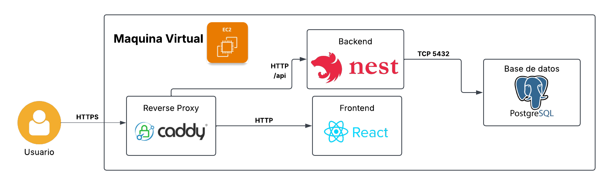

# Sistema de Confirmación de Asistencia y Promociones

## Descripción

Se implementó una aplicación web para la confirmación de asistencia de clientes a eventos y la selección de productos y servicios disponibles durante el evento.

La aplicación permite registrar la información del cliente, seleccionar el evento y horario de asistencia, consultar los productos y servicios disponibles y realizar la confirmación correspondiente.

El sistema también realiza el cálculo de descuentos de acuerdo con la cantidad y tipo de elementos seleccionados y envía un correo electrónico con el detalle de la confirmación.

La solución está dividida en frontend, backend y base de datos, permitiendo mantener separadas las responsabilidades de cada componente.

---

## Tecnologías utilizadas

### Backend

El backend fue desarrollado utilizando **NestJS** sobre **TypeScript**.

NestJS fue utilizado debido a que proporciona una estructura modular y organizada para el desarrollo del backend. Esto permite realizar una mejor división de responsabilidades dentro del código, manteniendo separados los controladores, servicios, repositorios, entidades y módulos.

Esta estructura permite obtener un mejor desacoplamiento entre los diferentes componentes de la aplicación, facilitando el entendimiento del código, su mantenimiento y su escalabilidad.

El backend expone una API REST utilizada por el frontend para realizar las diferentes operaciones del sistema.

Para el manejo de la información almacenada en la base de datos se utilizó **TypeORM**.

TypeORM permite trabajar con las entidades de la aplicación y realizar las operaciones necesarias sobre PostgreSQL utilizando objetos de TypeScript, manteniendo separada la lógica de acceso a datos del resto de la aplicación.

La estructura utilizada en el backend permite mantener una separación similar a:

### Controller

El **Controller** se encarga de recibir las solicitudes realizadas a la API y devolver una respuesta al cliente. Define las rutas o endpoints disponibles y delega la lógica correspondiente al Service.

### Service

El **Service** contiene la lógica principal de la aplicación. Se encarga de procesar la información, aplicar validaciones y reglas de negocio, y coordinar las operaciones necesarias antes de acceder a los datos.

### Repository

El **Repository** se encarga del acceso a la base de datos por medio de **TypeORM**. Centraliza las consultas y operaciones realizadas sobre la información, manteniendo separada la lógica de persistencia del resto de la aplicación.

---

### Frontend

El frontend fue desarrollado utilizando **React**, **Vite** y **TypeScript**.

React permite dividir la interfaz gráfica en diferentes componentes, facilitando la separación de las diferentes secciones de la aplicación.

Cada componente mantiene una responsabilidad específica dentro de la interfaz, permitiendo organizar de mejor manera elementos como:

- Información del cliente.
- Selección de eventos.
- Selección de productos y servicios.
- Confirmación de asistencia.
- Visualización de resultados.

Esta separación permite mantener una interfaz más organizada y facilita la modificación o incorporación de nuevas funcionalidades.

Vite fue utilizado como herramienta para el desarrollo y construcción del frontend.

---

### Base de datos

La información de la aplicación se almacena utilizando **PostgreSQL**.

PostgreSQL se encarga de almacenar la información relacionada con clientes, eventos, productos, servicios, registros de asistencia y resultados generados durante el proceso de confirmación.

[Documentacion Base de Datos](./Database/README.MD)

---

## Contenerización

La aplicación fue contenerizada utilizando **Docker**.

Cada componente principal posee su propia imagen:

- **Frontend** con React y Nginx.
- **Backend** con NestJS.
- **Base de datos** con PostgreSQL.
- **Caddy** como servidor de entrada y manejo de HTTPS.

Los archivos utilizados para construir las imágenes del frontend y backend se encuentran dentro de sus respectivos directorios.

- Ver [Docker Compose](./docker-compose.yml)
- Ver [Dockerfile - Frontend](./frontend/Dockerfile)
- Ver [Dockerfile - Backend](./backend/Dockerfile)

---

## Docker Compose

Todos los servicios de la aplicación son administrados utilizando **Docker Compose**.

El archivo principal de configuración se encuentra en:

- Ver [Docker Compose](./docker-compose.yml)

Docker Compose se encarga de construir las imágenes necesarias, crear la red entre los servicios y levantar los contenedores de la aplicación.

La comunicación interna se realiza utilizando los nombres definidos para cada servicio dentro de Docker Compose.

PostgreSQL y el backend permanecen dentro de la red interna creada por Docker Compose y no necesitan ser expuestos directamente hacia Internet.

---

## Nginx

El frontend utiliza **Nginx** para servir los archivos generados durante la construcción de la aplicación React.

Después de ejecutar el proceso de construcción del frontend, los archivos generados son copiados dentro de la imagen de Nginx.

Nginx se encarga de entregar la aplicación al usuario y permite que React funcione correctamente dentro del contenedor.

[Nginx Configuracion](./frontend/nginx.conf)

---

## Caddy

Se utilizó **Caddy** como servidor de entrada para la aplicación desplegada.

Caddy se encarga de recibir las solicitudes realizadas desde Internet y dirigirlas hacia los servicios correspondientes dentro de Docker Compose.

También se encarga del manejo del certificado SSL/TLS, permitiendo que la aplicación pueda ser utilizada mediante HTTPS.

Las solicitudes dirigidas hacia la API son enviadas al backend, mientras que las demás solicitudes son enviadas hacia el frontend.

---

## Despliegue

La aplicación fue desplegada utilizando una **máquina virtual**.

Dentro de la máquina virtual se encuentra instalado Docker y Docker Compose.

El código fuente del proyecto es descargado dentro de la máquina virtual y todos los servicios son levantados mediante el archivo:

[Docker Compose](./docker-compose.yml)

Esto permite administrar desde un mismo archivo:

- Frontend.
- Backend.
- Base de datos.
- Nginx.
- Caddy.
- Volúmenes.
- Redes internas.
- Variables de entorno.

El uso de Docker Compose permite que el entorno de ejecución sea reproducible y que todos los componentes necesarios puedan levantarse mediante un único comando.

---

## Ejecución con Docker Compose

Desde el directorio principal del proyecto, donde se encuentra `docker-compose.yml`, construir las imágenes:

```bash
docker compose build
```

Levantar todos los servicios:

```bash
docker compose up -d
```

También es posible construir y levantar nuevamente todos los servicios utilizando:

```bash
docker compose up -d --build
```

Verificar el estado de los contenedores:

```bash
docker compose ps
```

Visualizar los logs:

```bash
docker compose logs
```

Visualizar los logs en tiempo real:

```bash
docker compose logs -f
```

Detener la aplicación:

```bash
docker compose down
```

Este comando elimina los contenedores y la red creada por Docker Compose, pero mantiene los volúmenes utilizados para almacenar la información.

Para eliminar también los volúmenes:

```bash
docker compose down -v
```

El uso de `-v` elimina también el volumen de PostgreSQL, por lo que debe utilizarse únicamente cuando se desea eliminar la información almacenada en la base de datos.

---

## Variables de entorno

Las variables utilizadas por Docker Compose se encuentran definidas mediante un archivo `.env`, que no es publicado en el repositorio.

Dentro de estas variables se encuentra la configuración necesaria para:

- PostgreSQL.
- Sesiones.
- Servicio de correo electrónico.
- Entorno de ejecución.

---

## Acceso a la aplicación

La aplicación desplegada se encuentra disponible mediante el dominio:

```text
https://usaclab.com
```

El acceso se realiza mediante HTTPS.

Caddy se encarga de recibir las solicitudes realizadas al dominio y administrar el certificado utilizado para la conexión segura.
---

## Arquitectura


